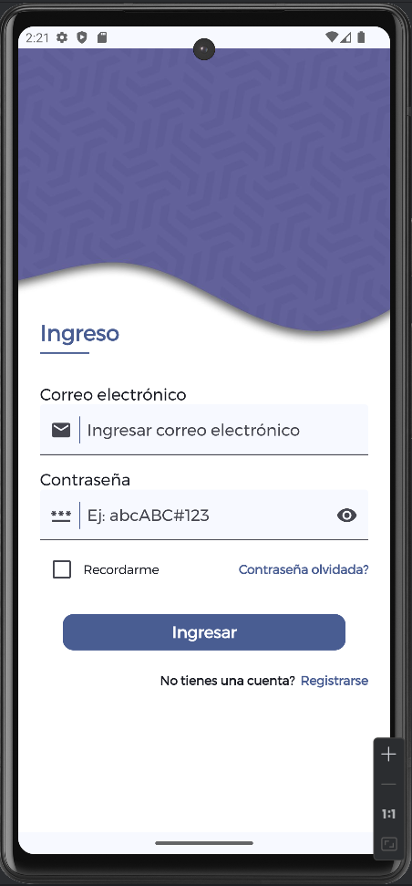
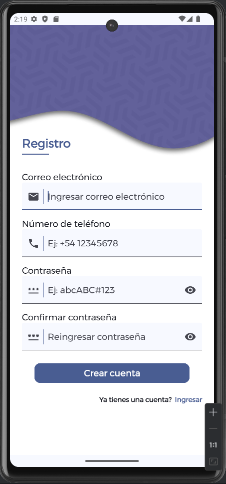

# PROYECTO UI DESIGN - PANTALLAS DE INGRESO Y REGISTRO

Este proyecto de una aplicación Android demostrativa muestra el diseño de la interfaz gráfica de las pantallas de Ingreso y Registro. El proyecto está realizado en lenguaje Kotlin y el kit de herramientas de desarrollo UI - Jetpack Compose.

> [!IMPORTANT]
> Si te interesa aprender cómo realizar alguna de estas funcionalidades de la aplicación, brindamos pequeños cursos de manera virtual y personalizada. O si deseas ayuda de un Desarrollador Junior o Senior **garantizado** para alguna aplicación que tienes en mente, puedes contactarnos por Whatsapp al [wa.me/59170616269](https://wa.me/59170616269).

## VIDEO DE DEMOSTRACIÓN

https://github.com/user-attachments/assets/9e969dc3-2efd-4cd1-a58a-0fbe37b04899

## DESCRIPCIÓN DEL PROYECTO

A continuación se describe las partes o funciones que tiene cada pantalla del proyecto.

### PANTALLA DE INGRESO

1. Fondo de pantalla con un diseño.
2. Título de pantalla.
3. Nombre de campo o label.
4. Los campos incluyen un icono que hace referencia al tipo de datos a ingresarse.
5. Los campos también cuentan con un placeholder que describa el tipo de datos a ingresar.
6. El campo de contraseña cuenta con la funcionalidad de mostrar u ocultar la contraseña que el usuario está ingresando.
7. En el caso de que se introduzca algún dato erroneamente, muestra un aviso de que los datos ingresados son incorrectos.
8. Para reemplazar funcionalidades que van más allá del propósito del proyecto contiene mensajes o avisos emergentes para indicar la acción realizada.
9. Finalmente el enlace de "Ingresar" lleva a la pantalla de "Registro".

### PANTALLA DE SIGNUP

1. Fondo de pantalla con un diseño.
2. Título de pantalla.
3. Nombre de campo o label, replicar el mismo diseño, si se desea se puede sugerir otro estilo.
4. Los campos incluyen un icono que hace referencia al tipo de datos a ingresarse.
5. Los campos también cuentan con un placeholder que describa el tipo de datos a ingresar.
6. El campo de contraseña cuenta con la funcionalidad de mostrar u ocultar la contraseña que el usuario está ingresando.
7. El campo de confirmación de contraseña verifica que la contraseña ingresada sea la misma que ingresó el usuario anteriormente.
8. En el caso de que se introduzca algún dato erroneamente, muestra un aviso de que los datos ingresados son incorrectos.
9. Para reemplazar funcionalidades que van más allá del propósito del proyecto contiene mensajes o avisos emergentes para indicar la acción realizada.
10. Finalmente el enlace de "Crear cuenta" lleva a la pantalla de "Ingreso".

## PANTALLAS A OBTENER

 

## APLICACIÓN DESCARGABLE

Este repositorio cuenta con el instalador APK de la aplicación, para fines de prueba en un dispositivo físico o virtual en un equipo, como sugerencia de un dispositivo virtual de mejor rendimiento que el emulador de Android Studio, se puede usar BlueStacks. El archivo APK de ésta aplicación se encuentra en el directorio principal del proyecto, junto a MainActivity.kt.

> [!WARNING]
> Este repositorio tiene como única finalidad mostrar un portafolio de proyectos realizados, para mostrar la experiencia y conocimiento en el desarrollo de aplicaciones móviles con Android Studio, conocimientos de Kotlin y el kit de herramientas UI Jetpack Compose.
> 
> Este repositorio no cuenta con todos los archivos de código de la aplicación para clonar y hacer pruebas o modificaciones. Si tiene interés en acceder al código de desarrollo de la aplicación o pertenecer a una comunidad exclusiva de Desarrolladores Android para tener acceso al código de cientos de aplicaciones de prueba desarrolladas, puede contactarse con nosotros por Whatsapp al [wa.me/59170616269](https://wa.me/59170616269).

### Te agradeceríamos que nos ayudes con una ⭐ para seguir creciendo en la comunidad de GitHub.
